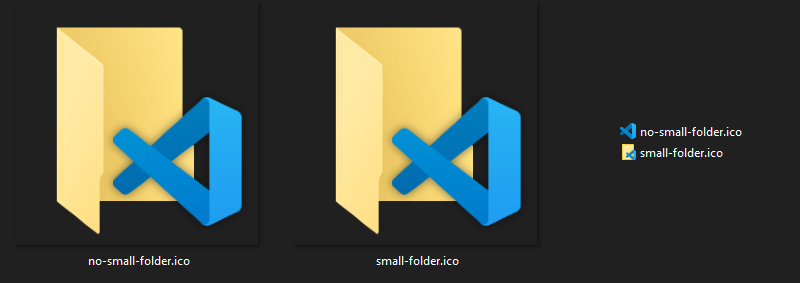

# WinLabeler

The easiest way to create your own custom Windows folder icons.

## 🚧 In development 🚧

This project is still in development. **But there is already a working prototype.**

## How to use

> 💡 You need ImageMagick installed on your computer. You can download it [here](https://imagemagick.org/script/download.php).

First install Wand:

```bash
pip install Wand
```

Then, run the script:
---
```bash
python winLabeler.py "C:\Users\User\example.png"
```
###### Output name will be "out.ico" by default. Program will use a folder for the small icon by default
---
```bash
python winLabeler.py "C:\Users\User\example.png" -ns
```
###### Output name will be "out.ico" by default. Program will not use a folder for the small icon
---
```bash
python winLabeler.py "C:\Users\User\example.png" -ns -o "my_icon.ico"
```
###### Output name will be "my_icon.ico". Program will not use a folder for the small icon
---

## What `-ns` does

`-ns` stands for "no small folder". It means that the program will not use a folder for the small icon.

Here is an example of the difference:



> ⚠ Expect some bugs. This is sill a **proof of concept**.
